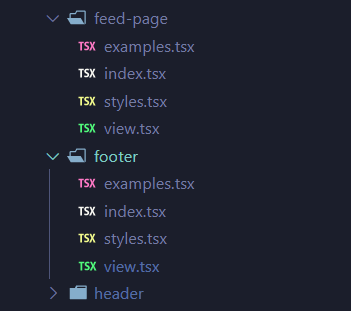

# JS Nomo

A fork of the great VS Code Icon Theme [Nomo macOS Dark](https://github.com/Gaulomatic/Vscode-IconTheme-Nomo-macOS-Dark) by [@Gaulomatic](https://github.com/Gaulomatic) but with coloured icons for various JavaScript and TypeScript files.

Links

-   [Figma designs](https://www.figma.com/file/KkRx04I7Zpo8zBGxlwBKwd/js-nomo)
-   [Dracular colour palette](https://github.com/dracula/dracula-theme)
